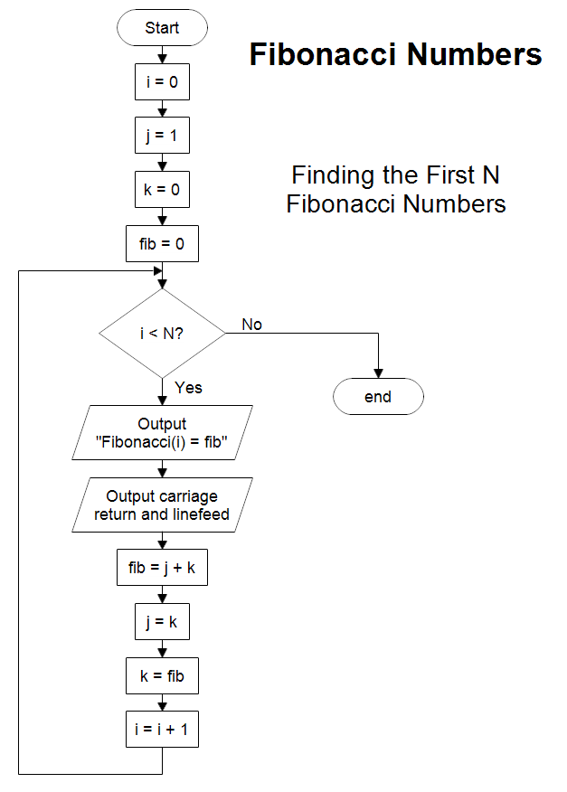
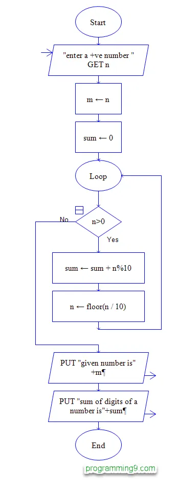
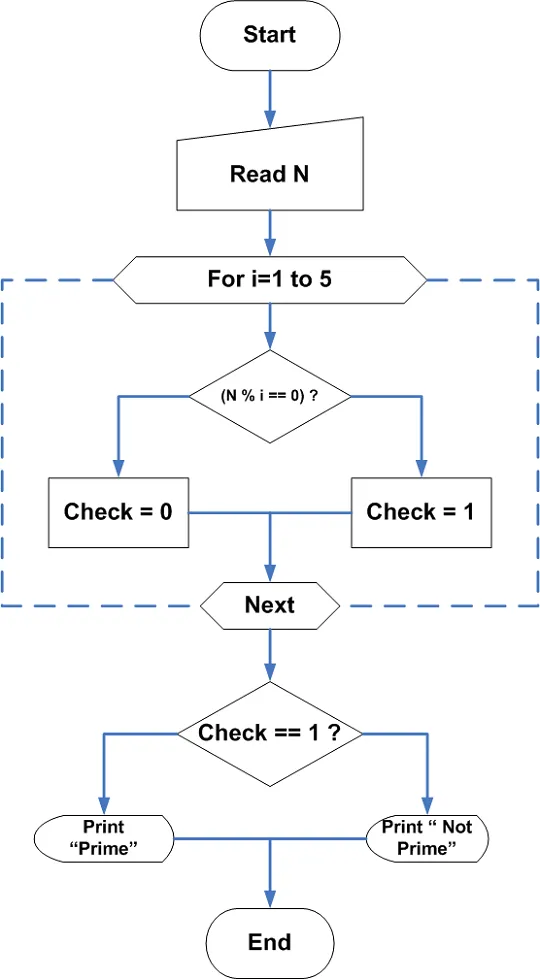
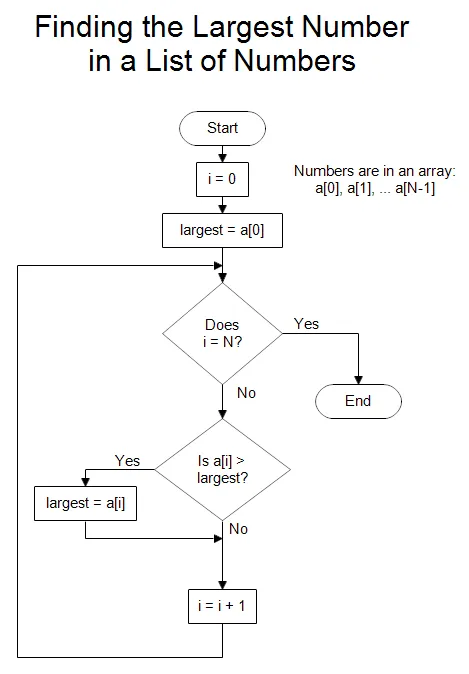
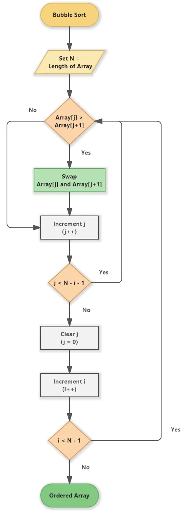

---


### **Basic Computer Concepts**  

#### **1. Different Generations of Computer Hardware**  
Computers have gone through five stages of development, each with new technology making them faster and better:  

- **🔹 First Generation (1940s-1950s): Vacuum Tubes**  
  - These computers used vacuum tubes to process data and magnetic drums to store information.  
  - They were huge, slow, and got very hot.  
  - **Example**: ENIAC (the first general-purpose computer).  

- **🔹 Second Generation (1950s-1960s): Transistors**  
  - Transistors replaced vacuum tubes, making computers smaller, faster, and cooler.  
  - These computers were still large but more reliable.  
  - **Example**: IBM 1401.  

- **🔹 Third Generation (1960s-1970s): Integrated Circuits (ICs)**  
  - Small chips with many transistors were introduced, reducing the size and cost of computers.  
  - These computers could do more tasks at once and were used in offices.  
  - **Example**: IBM System/360.  

- **🔹 Fourth Generation (1970s-Present): Microprocessors**  
  - Microprocessors put all computer functions on a single chip, leading to personal computers (PCs).  
  - Computers became smaller, affordable, and faster.  
  - **Example**: The first microprocessor, Intel 4004, and Apple Macintosh.  

- **🔹 Fifth Generation (Present and Beyond): Artificial Intelligence (AI)**  
  - Modern computers focus on things like learning, problem-solving, and understanding language.  
  - **Example**: Google Assistant, Siri, and IBM Watson.

---

#### **2. Modern Taxonomy of Computers**  
Computers are grouped based on how they are used and their power:  

- **🔹 Supercomputers**  
  - The fastest and most powerful computers used for big tasks like weather prediction and space research.  
  - **Example**: Summit (by IBM).  

- **🔹 Mainframe Computers**  
  - Big computers used by companies for storing and processing huge amounts of data.  
  - **Example**: Computers used in banks and airlines.  

- **🔹 Minicomputers (Mid-Range Computers)**  
  - Smaller than mainframes, they are used by medium-sized businesses for tasks like managing inventory.  
  - **Example**: PDP-11.  

- **🔹 Workstations**  
  - High-performance computers for tasks like video editing, designing, and 3D modeling.  
  - **Example**: Computers used by architects or graphic designers.  

- **🔹 Personal Computers (PCs)**  
  - Regular computers for everyday use like studying, browsing, and gaming. These include desktops and laptops.  
  - **Example**: Dell, HP laptops.  

- **🔹 Mobile Computers**  
  - Small, portable devices like smartphones and tablets that can be carried anywhere.  
  - **Example**: iPhones, iPads, Android devices.  

- **🔹 Embedded Systems**  
  - Special computers built into machines or devices to do specific jobs, like in cars or washing machines.  
  - **Example**: The computer that controls a car’s engine.  

---


### **Program Structure and Development Guidelines**  

#### **1. Structure of Programs**  
A computer program typically follows a structured approach that ensures clarity, organization, and efficiency.  

- **🔹 Header/Declaration Section**: Includes necessary declarations, such as variables, constants, and libraries.  
- **🔹 Main Function or Execution Point**: The part where the main logic is implemented.  
- **🔹 Processing Logic**: The sequence of operations to perform the desired task.  
- **🔹 Output/Results**: Where the program displays or returns the results.  

#### **2. Program Development Guidelines**  
To ensure programs are well-structured and maintainable:  

- **🔹 Planning**: Define requirements and design before coding.  
- **🔹 Modularity**: Break down the program into smaller, manageable units (functions, modules).  
- **🔹 Code Readability**: Use clear and meaningful variable names, comments, and indentation.  
- **🔹 Testing**: Use debugging tools and test cases to identify errors early.  
- **🔹 Optimization**: Ensure efficient use of resources (memory, CPU).  

---


### **Programming Languages and Algorithms**  

#### **1. Programming Languages**  

- **🔹 Machine Language**  
  - The lowest-level language, consisting of binary code (0s and 1s) that the computer directly understands.  
  - **Example**: `1010 1101` for a specific instruction.  

- **🔹 Assembly Language**  
  - A low-level language using symbolic names (mnemonics) for machine instructions.  
  - **Example**: `MOV A, B` translates to `1010 1101`.  

- **🔹 High-Level Languages**  
  - **Procedural Languages**: High-level languages designed with a focus on functions and structured programming (e.g., C, Pascal, Fortran).  
  - **Object-Oriented Languages**: Focus on objects (data and behavior) and principles like inheritance, encapsulation, and polymorphism (e.g., C++, Java, Python).  

- **🔹 Fourth Generation Languages (4GLs)**  
  - Simplify programming tasks and improve productivity (e.g., SQL for database queries, HTML, MATLAB).  

#### **2. Object Code & Executable Code**  
- **🔹 Object Code**: The intermediate code produced by a compiler or assembler, not yet executable.  
- **🔹 Executable Code**: The final code that is directly run by the operating system.  

---

#### **3. Algorithms – Basic Concept**  
- **🔹 Definition**: A set of well-defined, step-by-step instructions to solve a problem.  
- **🔹 Characteristics**:  
  - **Finiteness**: A clear number of steps.  
  - **Definiteness**: Precise instructions for each step.  
  - **Input and Output**: Takes input, processes it, and produces output.  
- **🔹 Purpose**: Algorithms are used to solve problems, perform tasks efficiently, and ensure repeatability.  

---


### **Typical Algorithms**  

#### **1. Algorithm for Finding the Sum of a Series**  
- **🔹 Problem**: Find the sum of the first N natural numbers.  
- **🔹 Algorithm Steps**:  
  1. Initialize a sum variable to 0.  
  2. Loop from 1 to N.  
  3. Add each number to the sum.  
  4. Print the sum.  

- **🔹 Example**:  
  ```  
  Start  
      Sum = 0  
      For i = 1 to N  
          Sum = Sum + i  
      End For  
      Print Sum  
  End  
  ```

#### **2. Algorithm to Check Whether a Number is Prime**  
- **🔹 Problem**: Determine if a given number is prime.  
- **🔹 Algorithm Steps**:  
  1. If the number is less than or equal to 1, return "Not Prime."  
  2. Loop from 2 to √N.  
  3. If N is divisible by any number in this range, return "Not Prime."  
  4. If no divisors are found, return "Prime."  

- **🔹 Example**:  
  ```  
  Start  
      Read N  
      If N <= 1  
          Print "Not Prime"  
      Else  
          For i = 2 to √N  
              If N % i == 0  
                  Print "Not Prime"  
                  Exit  
              End If  
          End For  
          Print "Prime"  
      End If  
  End  
  ```

#### **3. Algorithm for Finding the Largest Element in an Array**  
- **🔹 Problem**: Find the largest element in an array of N numbers.  
- **🔹 Algorithm Steps**:  
  1. Initialize a variable `max` to store the largest element.  
  2. Loop through the array, comparing each element with `max`.  
  3. If the current element is greater than `max`, update `max`.  
  4. Print the largest element.  

- **🔹 Example**:  
  ```  
  Start  
      Read N and the array elements  
      max = array[0]  
      For i = 1 to N-1  
          If array[i] > max  
              max = array[i]  
      End For  
      Print max  
  End  
  ```

#### **4. Algorithm for Sorting a Given Set of Numbers**  
- **🔹 Problem**: Sort an array of N numbers in ascending order.  
- **🔹 Algorithm Steps (Bubble Sort)**:  
  1. Loop through the array.  
  2. Compare adjacent elements and swap if necessary.  
  3. Repeat until the array is sorted.  
  4. Print the sorted array.  

- **🔹 Example**:  
  ```  
  Start  
      Read N and the array elements  
      For i = 0 to N-1  
          For j = 0 to N-i-1  
              If array[j] > array[j+1]  
                  Swap array[j] and array[j+1]  
          End For  
      End For  
      Print sorted array  
  End  
  ```

---
```


---

### **Hardware and Software**

#### **1. Hardware**  
- Hardware refers to the physical parts of a computer that you can see and touch.  
- **Examples**:  
  - **Input devices**: Devices like a keyboard, mouse, or scanner that help you send data to the computer.  
  - **Output devices**: Devices like a monitor or printer that show results or information from the computer.  
  - **Storage devices**: Hard drives, SSDs, or USB drives that store data.  
  - **Processing units**: The **Central Processing Unit (CPU)** is like the brain of the computer, performing all calculations and processing tasks.  

#### **2. Software**  
- Software refers to the programs and instructions that tell the hardware what to do.  
- There are two main types of software:  
  1. **System Software**:  
     - Controls the hardware and manages computer operations.  
     - **Example**: Operating systems like Windows, macOS, or Android.  
  2. **Application Software**:  
     - Helps users perform specific tasks.  
     - **Example**: Microsoft Word for typing, Google Chrome for browsing, or WhatsApp for chatting.  

#### **Hardware vs. Software**  
| **Feature**     | **Hardware**                           | **Software**                           |  
|------------------|---------------------------------------|----------------------------------------|  
| **Definition**   | Physical parts of a computer.         | Instructions that control the hardware.|  
| **Examples**     | CPU, monitor, keyboard.               | Operating systems, apps, games.        |  
| **Tangibility**  | Can be touched.                      | Cannot be touched.                     |  

---

### **Programming Languages and Algorithms**

#### **1. Programming Languages**  

- **🔹 Machine Language**  
  - The lowest-level language, consisting of binary code (0s and 1s) that the computer directly understands.  
  - **Example**: `1010 1101` for a specific instruction.  

- **🔹 Assembly Language**  
  - A low-level language using symbolic names (mnemonics) for machine instructions.  
  - **Example**: `MOV A, B` translates to `1010 1101`.  

- **🔹 High-Level Languages**  
  - **Procedural Languages**: High-level languages designed with a focus on functions and structured programming (e.g., C, Pascal, Fortran).  
  - **Object-Oriented Languages**: Focus on objects (data and behavior) and principles like inheritance, encapsulation, and polymorphism (e.g., C++, Java, Python).  

- **🔹 Fourth Generation Languages (4GLs)**  
  - Simplify programming tasks and improve productivity (e.g., SQL for database queries, HTML, MATLAB).  

#### **2. Object Code & Executable Code**  
- **🔹 Object Code**: The intermediate code produced by a compiler or assembler, not yet executable.  
- **🔹 Executable Code**: The final code that is directly run by the operating system.  

---

#### **3. Algorithms – Basic Concept**  
- **🔹 Definition**: A set of well-defined, step-by-step instructions to solve a problem.  
- **🔹 Characteristics**:  
  - **Finiteness**: A clear number of steps.  
  - **Definiteness**: Precise instructions for each step.  
  - **Input and Output**: Takes input, processes it, and produces output.  
- **🔹 Purpose**: Algorithms are used to solve problems, perform tasks efficiently, and ensure repeatability.  

---

### **Typical Algorithms**

#### **1. Algorithm for Finding the Sum of a Series**  
- **🔹 Problem**: Find the sum of the first N natural numbers.  
- **🔹 Algorithm Steps**:  
  1. Initialize a sum variable to 0.  
  2. Loop from 1 to N.  
  3. Add each number to the sum.  
  4. Print the sum.  

- **🔹 Example**:  
  ```  
  Start  
      Sum = 0  
      For i = 1 to N  
          Sum = Sum + i  
      End For  
      Print Sum  
  End  
  ```

#### **2. Algorithm to Check Whether a Number is Prime**  
- **🔹 Problem**: Determine if a given number is prime.  
- **🔹 Algorithm Steps**:  
  1. If the number is less than or equal to 1, return "Not Prime."  
  2. Loop from 2 to √N.  
  3. If N is divisible by any number in this range, return "Not Prime."  
  4. If no divisors are found, return "Prime."  

- **🔹 Example**:  
  ```  
  Start  
      Read N  
      If N <= 1  
          Print "Not Prime"  
      Else  
          For i = 2 to √N  
              If N % i == 0  
                  Print "Not Prime"  
                  Exit  
              End If  
          End For  
          Print "Prime"  
      End If  
  End  
  ```

#### **3. Algorithm for Finding the Largest Element in an Array**  
- **🔹 Problem**: Find the largest element in an array of N numbers.  
- **🔹 Algorithm Steps**:  
  1. Initialize a variable `max` to store the largest element.  
  2. Loop through the array, comparing each element with `max`.  
  3. If the current element is greater than `max`, update `max`.  
  4. Print the largest element.  

- **🔹 Example**:  
  ```  
  Start  
      Read N and the array elements  
      max = array[0]  
      For i = 1 to N-1  
          If array[i] > max  
              max = array[i]  
      End For  
      Print max  
  End  
  ```

#### **4. Algorithm for Sorting a Given Set of Numbers**  
- **🔹 Problem**: Sort an array of N numbers in ascending order.  
- **🔹 Algorithm Steps (Bubble Sort)**:  
  1. Loop through the array.  
  2. Compare adjacent elements and swap if necessary.  
  3. Repeat until the array is sorted.  
  4. Print the sorted array.  

- **🔹 Example**:  
  ```  
  Start  
      Read N and the array elements  
      For i = 0 to N-1  
          For j = 0 to N-i-1  
              If array[j] > array[j+1]  
                  Swap array[j] and array[j+1]  
          End For  
      End For  
      Print sorted array  
  End  
  ```

---


---

```markdown
### **Evolution of Computers and Their Impact on Society**

#### **1. Early Computers (1940s-1950s)**  
- **First Generation Computers**:  
  - Used vacuum tubes for processing, which made them large, expensive, and slow.  
  - **Impact**: Limited to large organizations like governments and universities.  
  - **Example**: ENIAC.  

#### **2. Second Generation (1950s-1960s)**  
- **Transistors** replaced vacuum tubes, reducing size and cost.  
- **Impact**:  
  - Faster and more reliable computers.  
  - Enabled more organizations and businesses to use computers.  
  - **Example**: IBM 1401.  

#### **3. Third Generation (1960s-1970s)**  
- **Integrated Circuits (ICs)**: Multiple transistors on a single chip.  
- **Impact**:  
  - Smaller, more powerful, and cheaper computers.  
  - Introduced operating systems like Unix and Microsoft Windows.  
  - Computers became available to businesses, schools, and individuals.  
  - **Example**: IBM System/360.  

#### **4. Fourth Generation (1970s-Present)**  
- **Microprocessors**: Entire CPU on a single chip.  
- **Impact**:  
  - Explosion in personal computers (PCs).  
  - Enabled the rise of the internet, mobile devices, and smartphones.  
  - Increased accessibility for homes, offices, and businesses.  
  - **Example**: Intel 4004 microprocessor.  

#### **5. Fifth Generation (Present and Beyond)**  
- **Artificial Intelligence (AI)** and quantum computing.  
- **Impact**:  
  - AI-driven technologies like virtual assistants, robotics, and self-driving cars.  
  - Enhanced automation, big data analysis, and real-time processing.  
  - Greater connectivity and smarter systems in areas like healthcare, finance, and education.  
  - **Example**: IBM Watson and Google DeepMind.  

---

#### **Impact on Society**  
- **Communication**: Computers revolutionized communication with email, video calls, and social media.  
- **Education**: E-learning platforms, digital classrooms, and online resources have made learning more accessible.  
- **Work**: Automation and computers increased productivity in industries, leading to jobs in tech and reducing manual tasks.  
- **Healthcare**: Computers help with medical research, diagnostics, and treatment planning.  
- **Entertainment**: Streaming services, video games, and interactive media are now widely available.  

---

### **Classification of Computers**  

#### **1. Mainframe Computers**  
- **Definition**: Large, powerful computers used by organizations for processing vast amounts of data and running multiple applications simultaneously.  
- **Characteristics**:  
  - High processing power, large memory, and many users can access them at the same time.  
  - **Example**: IBM zSeries, used for tasks like financial transactions and large-scale data processing.  

#### **2. Personal Computers (PCs)**  
- **Definition**: Computers designed for individual use, commonly used at home and in small businesses.  
- **Types**:  
  - **Desktops**: Fixed-location computers used for general-purpose tasks like word processing, gaming, and browsing.  
  - **Laptops**: Portable computers that can be used anywhere, offering flexibility for work or study.  
- **Characteristics**:  
  - Affordable, smaller size, and sufficient power for most everyday tasks like emails, office work, and internet browsing.  
  - **Examples**: Dell, HP, Apple (MacBooks).  

#### **3. Mobile Devices**  
- **Definition**: Portable, handheld devices designed for on-the-go use, with features like wireless communication and touch interfaces.  
- **Types**:  
  - **Smartphones**: Small, powerful devices combining the capabilities of a computer, phone, and internet.  
  - **Tablets**: Larger than smartphones, used for browsing, media consumption, and productivity.  
- **Characteristics**:  
  - Compact, lightweight, and always connected.  
  - Used for communication, media, and mobile applications.  
- **Examples**: iPhones, Samsung Galaxy, iPads.  

#### **4. Embedded Systems**  
- **Definition**: Special computers built into machines or devices to do specific jobs, like in cars or washing machines.  
- **Examples**: The computer that controls a car’s engine.  

---

### **Information and Communication Technologies (ICTs)**

#### **Definition of ICT**  
- **Information and Communication Technologies (ICT)** refer to the tools and systems that help people store, process, and communicate information.  
- These technologies combine computing, communication networks, and software to transmit data efficiently.

#### **Components of ICT**  
1. **Hardware**: Physical devices like computers, servers, routers, and smartphones that process and store data.  
2. **Software**: Programs and applications that help users create, process, store, and manage data (e.g., operating systems, databases, web browsers).  
3. **Networks**: Systems that connect devices to share information (e.g., the internet, intranet, LAN, WAN).  
4. **Data**: Raw facts and figures processed into useful information.

#### **Examples of ICTs**  
- **Internet**: Enables global communication, sharing information, and online services.  
- **Mobile Communication**: Smartphones, tablets, and wireless networks allow instant communication and access to information.  
- **Computers & Applications**: Used for tasks like document creation, data analysis, and web browsing.  
- **Social Media & Collaboration Tools**: Platforms like Facebook, Zoom, and Google Drive facilitate communication, collaboration, and information sharing.

#### **Impact of ICTs on Society**  
- **Improved Communication**: Email, video conferencing, and social media have made communication faster and more accessible.  
- **Access to Information**: Online resources, e-learning, and search engines have made information available to everyone.  
- **Efficiency & Productivity**: Automation and ICTs have improved productivity in industries, reducing time and effort.  
- **Global Connectivity**: ICTs have enabled businesses and people to connect globally, fostering growth in trade and relationships.
```


---

### **Information System Development Process**

---

#### **Information System Development Process**

The **Information System Development Process** refers to the steps taken to design, develop, and implement systems that manage and process information to meet the needs of organizations.

#### **Steps in the Information System Development Process**  
1. **📋 Requirements Analysis**  
   - Understanding what the system needs to do by gathering input from users.  
   - Identifying user needs, goals, and problems.  
   - Tools used: **interviews**, **surveys**, and **workshops** to gather requirements.  

2. **🛠️ System Design**  
   - Creating the structure of the system, including how it will work and how the components will interact.  
   - **Types of Design**:  
     - **Logical Design**: Focuses on **what** the system will do, not **how** it will be built.  
     - **Physical Design**: Focuses on **how** the system will be implemented (software, hardware, databases, etc.).  

3. **🚀 Implementation**  
   - Building and installing the system based on the design.  
   - Coding, configuring hardware, and creating databases.  
   - **Testing** the system to ensure it works correctly.  
   - **Training** users on how to use the system.  

4. **🔍 Testing and Quality Assurance**  
   - Ensuring that the system performs correctly, is error-free, and meets the user’s requirements.  
   - Types of testing:  
     - **Unit Testing**: Testing individual components of the system.  
     - **System Testing**: Testing the system as a whole.  
     - **User Acceptance Testing (UAT)**: Ensures the system meets user expectations.  

5. **📦 Deployment**  
   - Delivering the system to users and putting it into operation.  
   - Making the system available to the organization for regular use.  
   - Providing **ongoing support** and **maintenance**.  

6. **🔧 Maintenance and Support**  
   - Regular updates, fixing bugs, and improving the system based on user feedback.  
   - Ensuring the system continues to meet the evolving needs of users.  

---

### **Computer Hardware – Input and Output Devices, Memory, and Central Processing Unit (CPU)**

---

#### **1. Input Devices**  
Input devices allow users to provide data and commands to a computer.  
- **🔢 Keyboard**: Used to enter text and commands.  
- **🖱️ Mouse**: A pointing device used to interact with the graphical interface.  
- **🖊️ Light Pen**: A pen-shaped input device used for pointing and drawing, often used in graphics or design applications.  
- **📲 Barcode Readers**: Used to read barcodes for data entry, common in retail.  
- **📷 Scanners**: Convert physical documents or images into digital format.  
- **MICR** (Magnetic Ink Character Recognition): Used by banks to read printed numbers on cheques.  
- **OCR** (Optical Character Recognition): Converts printed or written text into digital form.  
- **🎙️ Voice Recognition Systems**: Allow users to give spoken commands and convert speech to text.  
- **✍️ Handwriting Recognition Systems**: Convert handwritten text into digital form.  

---

#### **2. Output Devices**  
Output devices allow the computer to present information to users.  
- **💻 Monitor**: Displays visual output.  
- **🖨️ Printers**: Convert digital data into physical form (paper).  
- **📐 Plotters**: Used for printing large-scale, precise graphics, especially in fields like CAD (Computer-Aided Design).  
- **🎧 Speakers**: Output audio from the computer.  

---

#### **3. Central Processing Unit (CPU)**  
The CPU is the brain of the computer that performs instructions from programs.  
- **🔢 ALU (Arithmetic and Logic Unit)**: Performs arithmetic (like addition and subtraction) and logical operations (like comparisons).  
- **🔍 Control Unit**: Directs operations by controlling the flow of data within the computer.  
- **📦 Registers**: Small storage locations in the CPU that hold data temporarily while processing.  

---

#### **4. Memory (or Storage) Devices**  
Memory stores data and instructions needed for processing.  
- **RAM (Random Access Memory)**: Temporary storage that holds data and programs currently in use. Faster and volatile (erased when power is off).  
- **ROM (Read-Only Memory)**: Stores essential system instructions; non-volatile (does not lose data when the power is off).  
- **Secondary Storage (Hard Drives - HDD/SSD, CDs, DVDs)**: Permanent storage for files, programs, and data.  

---

### **Storage Devices – Primary Storage (RAM, ROM, EEPROM, PROM, EPROM)**
(important)
---

#### **1. RAM (Random Access Memory)**  
- **Function**: Temporary storage used by the computer to hold data and programs that are currently in use.  
- **Characteristics**:  
  - Fast, volatile memory (erased when power is off).  
  - Allows the CPU to quickly access data for processing.  
- **Example Use**: Open applications, documents, and running programs.  

#### **2. ROM (Read-Only Memory)**  
- **Function**: Stores essential system instructions, like the BIOS (Basic Input/Output System) that helps the computer boot up.  
- **Characteristics**:  
  - Non-volatile (retains data even when the power is off).  
  - Cannot be easily changed or written to.  
- **Example Use**: Boot process, firmware.  

#### **3. EEPROM (Electrically Erasable Programmable Read-Only Memory)**  
- **Function**: Can be erased and reprogrammed electrically.  
- **Characteristics**:  
  - Non-volatile, more flexible than ROM.  
  - Widely used for storing configuration settings.  
- **Example Use**: BIOS settings, firmware updates.  

#### **4. PROM (Programmable Read-Only Memory)**  
- **Function**: Once programmed, data cannot be erased or rewritten.  
- **Characteristics**:  
  - Non-volatile, but data is written during manufacturing.  
- **Example Use**: Used for storing firmware or microcontroller data.  

#### **5. EPROM (Erasable Programmable Read-Only Memory)**  
- **Function**: Can be erased using UV light and reprogrammed.  
- **Characteristics**:  
  - Non-volatile, requires special equipment to erase.  
- **Example Use**: Used for updating firmware or in situations requiring reprogrammable storage.  

---


---

### **Secondary Storage – Direct Access Devices and Serial Access Devices, Cache Memory, and Virtual Memory**  

---

#### **Secondary Storage Devices**  
### **Important 🌟 🌟**
#### **1. Direct Access Devices**  
- **Definition**: Devices that allow data to be accessed directly without having to go through other data.  
- **Examples**:  
  - **🔹 Hard Disks (HDD/SSD)**: Store large amounts of data like operating systems, applications, and user files.  
  - **🔹 CD-ROM & DVD**: Used for storing and reading data, like software and multimedia.  
  - **🔹 Flash Memory (e.g., USB drives)**: Provides fast data access for portable storage.  
- **Characteristics**:  
  - Fast data retrieval, as the data can be accessed randomly.  
  - Used for long-term storage and permanent data.

#### **2. Serial Access Devices**  
- **Definition**: Devices that require data to be accessed sequentially (one after the other).  
- **Examples**:  
  - **🔹 Magnetic Tape**: Used primarily for backups and archiving due to large storage capacity and sequential access.  
  - **🔹 Floppy Disks**: Old storage devices used mainly for small-scale storage.

#### **3. Cache Memory**  
- **Function**: A small amount of high-speed memory located close to the CPU.  
- **Characteristics**:  
  - Stores frequently accessed data to speed up processing.  
  - Faster than RAM but smaller in size.  
- **Purpose**: Helps reduce the time taken by the CPU to access data from RAM.

#### **4. Virtual Memory**  
- **Function**: Simulated memory created on a hard drive when the RAM runs out.  
- **Characteristics**:  
  - Used by the operating system to extend the apparent amount of RAM.  
  - Slower than actual RAM, but provides additional memory space when needed.  
- **Purpose**: Helps run larger applications by offloading data to disk.

---

### **Central Processing Unit (CPU)**  

---

#### **1. Control Unit (CU)**  
- **Function**: Directs and coordinates all the activities of the CPU.  
- **Characteristics**:  
  - Ensures that instructions are properly interpreted and executed.  
  - Manages data flow between the CPU, memory, and other devices.  
- **Role**: Controls the sequence of operations in the fetch-decode-execute cycle.

#### **2. Arithmetic and Logic Unit (ALU)**  
- **Function**: Performs arithmetic operations (like addition, subtraction) and logical operations (like comparisons).  
- **Characteristics**:  
  - The ALU processes data received from memory or other inputs.  
  - Operates on binary data to perform calculations.  
- **Role**: Carries out the actual computation and decision-making tasks.

#### **3. Decoders**  
- **Function**: Convert encoded instructions into signals that the CPU can understand.  
- **Characteristics**:  
  - Break down instructions from the instruction set into simpler steps that the ALU can execute.  
- **Role**: Decodes the machine language instructions into operations like “add”, “subtract”, or “load”.

#### **4. Registers**  
- **Function**: Small storage locations within the CPU that hold data temporarily.  
- **Characteristics**:  
  - Store data, instructions, and addresses that the CPU needs to process.  
  - Examples include the **🔹 Program Counter (PC)**, **🔹 Accumulator (ACC)**, and **🔹 Memory Address Register (MAR)**.  
- **Role**: Provide fast access to data and instructions for the CPU to process.

#### **5. Machine Instructions**  
- **Function**: Instructions written in machine language (binary code) that the CPU executes.  
- **Characteristics**:  
  - Basic operations like addition, subtraction, and data movement.  
- **Role**: The CPU interprets and executes these instructions step-by-step.

#### **6. Stored Program Concept**  
- **Function**: The idea that programs (software) and data are stored in memory and the CPU fetches and executes instructions stored in memory.  
- **Characteristics**:  
  - Allows computers to execute different tasks by changing the program stored in memory.  
- **Role**: Enabled the development of general-purpose computers, where instructions and data are no longer hardwired.

---


---

### **Program Execution Cycle and Arithmetic, Logical, and Shift Operations**

---

#### **Program Execution: Fetch-Decode-Execute Cycle**  

The CPU follows a repetitive cycle to process instructions from memory.

- **Fetch**:  
  - The CPU fetches the next instruction from memory.  
  - The Program Counter (PC) points to the location of the next instruction.  
  - The instruction is loaded into the **Instruction Register (IR)**.  

- **Decode**:  
  - The Control Unit decodes the instruction to determine what operation to perform.  
  - It breaks the instruction into operations like “add,” “move,” or “load.”  

- **Execute**:  
  - The ALU performs the required operation (arithmetic, logical, or shift operations).  
  - The result is stored in a register or memory.

---

#### **Arithmetic, Logical, and Shift Operations**  

- **Arithmetic Operations**:  
  - Perform basic mathematical operations like addition, subtraction, multiplication, and division.  
  - **Addition (+)**: Adds two numbers.  
    - **Example**: `5 + 3 = 8`  
  - **Subtraction (-)**: Subtracts the second number from the first.  
    - **Example**: `10 - 4 = 6`  
  - **Multiplication (*)**: Multiplies two numbers.  
    - **Example**: `6 * 2 = 12`  
  - **Division (/)**: Divides the first number by the second.  
    - **Example**: `20 / 5 = 4`  

---

- **Logical Operations**:  
  - Compare binary values (1s and 0s) and return true/false results.  
  - **AND (&&)**: Returns true if both operands are true.  
    - **Example**: `1 AND 1 = 1`  
  - **OR (||)**: Returns true if at least one operand is true.  
    - **Example**: `1 OR 0 = 1`  
  - **NOT (!)**: Inverts a value (true becomes false, false becomes true).  
    - **Example**: `NOT 1 = 0`  
  - **XOR (Exclusive OR)**: Returns true only if one operand is true, but not both.  
    - **Example**: `1 XOR 0 = 1`  

---

- **Shift Operations**:  
  - Move bits to the left (for multiplication by powers of 2) or to the right (for division by powers of 2).  
  - **Left Shift (<<)**: Shifts bits to the left, multiplying by 2.  
    - **Example**: `4 << 1 = 8` (binary 100 becomes 1000)  
  - **Right Shift (>>)**: Shifts bits to the right, dividing by 2.  
    - **Example**: `8 >> 1 = 4` (binary 1000 becomes 100)  

---

### **Binary, Octal, and Hexadecimal Conversion**  
For understanding conversions between **binary**, **octal**, and **hexadecimal**, refer to this useful guide:  
**[Binary, Octal, and Hexadecimal Conversion](https://www.youtube.com/watch?v=NY2gz_Kzc0Q) (clickhere)**  

---


---


---
## Important 
## **What is Software?**  
- **Definition**: Software refers to a set of instructions or programs that enable a computer to perform specific tasks. Unlike hardware, software is intangible and includes components such as operating systems, applications, and utilities.

---

## **Classification of Software**  

### 1. **System Software**  
- **Definition**: System software manages and controls computer hardware and provides a platform for other software to run.  
- **Functions**:  
  - **Operating Systems (OS)**: Manage hardware, memory, processing, and resources.  
  - **Utility Programs**: Handle tasks like maintenance, file management, and system security.  
- **Examples**:  
  - **Operating Systems**: Windows, macOS, Linux.  
  - **Utilities**: Disk cleanup, antivirus, backup tools.

### 2. **Application Software**  
- **Definition**: Application software helps users perform specific tasks such as creating documents, managing data, or solving problems.  
- **Functions**:  
  - Focuses on productivity and problem-solving.  
- **Examples**:  
  - **Productivity Software**: Microsoft Word, Excel, PowerPoint.  
  - **Web Browsers**: Google Chrome, Mozilla Firefox.  
  - **Media Players**: VLC, Windows Media Player.

### 3. **Utility Software**  
- **Definition**: Utility software focuses on system maintenance and optimization.  
- **Functions**:  
  - System performance improvement, security, and resource optimization.  
- **Examples**:  
  - Disk cleanup tools, antivirus software, backup utilities, system monitors.

---

## **Operating Systems (OS)**  

### 1. **What is an Operating System (OS)?**  
- **Definition**: An operating system (OS) is system software that acts as an interface between the user and computer hardware. It manages hardware resources and provides services to other software and applications.  
- **Purpose**: To ensure smooth operation of computer systems by managing tasks, resources, and providing a platform for applications to run.

---

### 2. **Key Functions of an OS**  
1. **Resource Management**  
   - Manages hardware resources like CPU, memory, storage, and I/O devices.  
   - Ensures efficient allocation and sharing of resources among processes.  
   
2. **Task Management**  
   - Handles multiple tasks (processes) using techniques like multitasking and scheduling.  
   - Ensures fair access to CPU resources.  
   
3. **File Management**  
   - Provides structure for organizing, storing, retrieving, and managing data.  
   - Supports file systems for efficient data storage and access.  
   
4. **User Interface**  
   - Provides user-friendly interfaces (command-line or graphical) for interacting with the system.  
   
5. **Security and Access Control**  
   - Controls access to system resources and ensures data security through authentication and permissions.

---

### 3. **Types of Operating Systems**  

1. **Batch Operating Systems**  
   - Execute jobs in batches without direct user interaction.  
   - Example: IBM’s OS/360 (early mainframe systems).  

2. **Time-Sharing Operating Systems**  
   - Allow multiple users to access the system simultaneously.  
   - Examples: Unix, Linux.  

3. **Real-Time Operating Systems (RTOS)**  
   - Used in embedded systems where quick responses are crucial.  
   - Examples: Windows CE, VxWorks.  

4. **Distributed Operating Systems**  
   - Manage resources across multiple systems connected via a network.  
   - Examples: Windows Server, Linux clusters.  

---

### 4. **Operating System as a Resource Manager**  

#### **Memory Management**  
- **Purpose**: Allocates and deallocates memory efficiently to ensure processes have enough space.  
- **Techniques**:  
  - **Paging**: Divides memory into fixed-size blocks (pages).  
  - **Segmentation**: Divides memory into segments based on program needs.  

#### **I/O Management**  
- **Purpose**: Manages data flow between the computer and peripheral devices.  
- **Functions**:  
  - Controls hardware devices through drivers.  
  - Buffers I/O operations, ensuring efficient use of devices.  

#### **Secondary Storage Management**  
- **Purpose**: Manages storage devices like hard drives, SSDs, etc., ensuring efficient data retrieval and storage.  
- **Techniques**:  
  - **File Systems**: Organizes data in directories.  
  - **Disk Scheduling**: Optimizes storage device access.  

#### **Processor Management**  
- **Purpose**: Controls CPU, ensuring fair access and efficient processing of tasks.  
- **Techniques**:  
  - **Scheduling**: Allocates CPU time to processes.  
  - **Context Switching**: Quickly switching between tasks to give CPU time to multiple programs.  

#### **Program Management**  
- **Purpose**: Ensures smooth execution of programs, managing their states (running, waiting, terminated).  

#### **Network Management**  
- **Purpose**: Manages communication between systems over a network.  
- **Functions**:  
  - Provides networking protocols and interfaces.  
  - Manages resources across distributed systems.

---

### 5. **Types of Operating Systems**  

1. **DOS (Disk Operating System)**  
   - Command-line based OS, simple, and limited to personal computers.  
   - No multitasking; single-tasking only.  
   - Example: MS-DOS.  

2. **Windows**  
   - GUI-based OS widely used for personal and business systems.  
   - Supports multitasking, user-friendly, and large ecosystem of applications.  
   - Examples: Windows 7, Windows 10, Windows 11.  

3. **Unix**  
   - Multi-user, multitasking OS commonly used in servers and workstations.  
   - Highly stable and secure, used in servers and scientific applications.  
   - Examples: Linux, MacOS (based on Unix).  

4. **Linux**  
   - Open-source, multi-user, and multitasking OS.  
   - Known for stability, flexibility, and use in servers, supercomputers, and embedded systems.  
   - Examples: Ubuntu, CentOS, Fedora.  

---


---


---


---

Happy learning! 🎉

---

---


---


---

## **Application Software**

### 1. **System Development Tools**  
- **Definition**: Tools used by developers to create, test, and manage software applications.  
- **Examples**:  
  - **Compilers**: Convert high-level code into machine-readable code.  
  - **Integrated Development Environments (IDEs)**: Provide a user-friendly environment for writing and debugging code (e.g., Visual Studio, Eclipse).  
  - **Text Editors**: Simple tools like Notepad++ used for coding.  

---

### 2. **Utilities**  
- **Definition**: Programs designed to perform specific tasks that help manage and maintain a computer system.  
- **Examples**:  
  - **Disk Cleanup Tools**: Remove temporary files and free up space.  
  - **Antivirus Software**: Protects the system from malware and viruses.  
  - **Backup Tools**: Ensure data is securely backed up and restored if necessary.  

---

### 3. **Application Packages**  
- **Definition**: Pre-designed software that serves specific tasks or needs.  
- **Examples**:  
  - **Productivity Software**: Microsoft Word, Excel, PowerPoint for creating documents, spreadsheets, and presentations.  
  - **Web Browsers**: Chrome, Firefox for browsing the internet.  
  - **Media Players**: VLC, Windows Media Player for playing multimedia files.  

---

### 4. **User-Written Programs**  
- **Definition**: Custom software developed by users or organizations to meet specific needs.  
- **Examples**:  
  - **Custom Business Applications**: Software like payroll systems, customer relationship management (CRM) systems.  
  - **Scripts and Macros**: Small programs written to automate repetitive tasks.  
  - **Web Applications**: Websites tailored for specific functions, like e-commerce platforms or inventory management systems.  

---


Here’s a simple **Flowchart** for the tasks you mentioned:
## college me teacher  se puchna ki flow chart ayega kya kyoki tera previous year me diya tha..
## link ----  https://www.youtube.com/watch?v=QCBV_KrB4wk (youtube  video )(for flowchart) 
---


---

# Software and Algorithms Overview

## Introduction  
This repository provides detailed insights into **software**, its classifications, and fundamental concepts, including **Application Software** components and key **algorithms** commonly used to solve problems.

---

## **1. Flowchart for Fibonacci Series Calculation**  
The Fibonacci series is a sequence where each number is the sum of the two preceding ones.

#### **Steps**:  
1. Start.  
2. Input a number (N).  
3. Initialize first two terms (F₀ and F₁).  
4. Repeat: Calculate the next term as F₀ + F₁.  
5. Print the terms or store them in an array.  
6. End.

#### **Flowchart**:  
_Fibonacci Series Flowchart_

---

## **2. Flowchart for Finding the Sum of a Series**  
- Example: Sum of first N natural numbers.

#### **Steps**:  
1. Start.  
2. Input N.  
3. Initialize sum = 0.  
4. Loop from 1 to N:  
   - Add current number to sum.  
5. Print the sum.  
6. End.

#### **Flowchart**:  


---

## **3. Flowchart for Checking Whether a Number is Prime**  
- A prime number is only divisible by 1 and itself.

#### **Steps**:  
1. Start.  
2. Input number N.  
3. Check if N is less than or equal to 1. If yes, return "Not Prime."  
4. Loop from 2 to √N:  
   - If N is divisible by any number in this range, return "Not Prime."  
5. If no divisors found, return "Prime."  
6. End.

#### **Flowchart**:  
_Prime Check Flowchart_

---

## **4. Flowchart for Finding the Largest Element in an Array**  
- Example: Given an array of numbers, find the maximum.

#### **Steps**:  
1. Start.  
2. Input N elements into the array.  
3. Initialize max = first element.  
4. Loop through each element:  
   - If current element > max, update max.  
5. Print the largest element.  
6. End.

#### **Flowchart**:  
_Largest Element Flowchart_

---

## **5. Flowchart for Sorting a Set of Numbers**  
- Example: Bubble sort or selection sort.

#### **Steps**:  
1. Start.  
2. Input N elements into the array.  
3. Loop through the array:  
   - Compare adjacent elements.  
   - If out of order, swap them.  
4. Repeat until the array is sorted.  
5. Print the sorted array.  
6. End.

#### **Flowchart**:  
_Sorting Flowchart_

---

## **Program Structure, Development Guidelines, Programming Languages, and Algorithms – Basic Concepts**

### **1. Structure of Programs**  
A computer program typically follows a structured approach that ensures clarity, organization, and efficiency.

#### **Structure**:  
1. **Header/Declaration Section**: Includes necessary declarations, such as variables, constants, and libraries.  
2. **Main Function or Execution Point**: The part where the main logic is implemented.  
3. **Processing Logic**: The sequence of operations to perform the desired task.  
4. **Output/Results**: Where the program displays or returns the results.

---

### **2. Program Development Guidelines**  
To ensure programs are well-structured and maintainable:

1. **Planning**: Define requirements and design before coding.  
2. **Modularity**: Break down the program into smaller, manageable units (functions, modules).  
3. **Code Readability**: Use clear and meaningful variable names, comments, and indentation.  
4. **Testing**: Use debugging tools and test cases to identify errors early.  
5. **Optimization**: Ensure efficient use of resources (memory, CPU).

---

### **3. Programming Languages**  

#### **a. Machine Language**  
- **Definition**: The lowest-level language, consisting of binary code (0s and 1s) that the computer directly understands.  
- **Example**: `1010 1101` for a specific instruction.

#### **b. Assembly Language**  
- **Definition**: A low-level language using symbolic names (mnemonics) for machine instructions.  
- **Example**: `MOV A, B` translates to `1010 1101`.

#### **c. High-Level Languages**  
- **Procedural Languages**:  
  - **Definition**: High-level languages designed with a focus on functions and structured programming.  
  - **Examples**: C, Pascal, Fortran.  
- **Object-Oriented Languages**:  
  - **Definition**: Focus on objects (data and behavior) and inheritance, encapsulation, and polymorphism.  
  - **Examples**: C++, Java, Python.

#### **d. Fourth Generation Languages (4GL)**  
- **Definition**: Languages designed to simplify programming tasks and improve productivity.  
- **Examples**: SQL (used for database queries), HTML, MATLAB.

---

#### **Object Code & Executable Code**  
- **Object Code**: The intermediate code produced by a compiler or assembler, not yet executable.  
- **Executable Code**: The final code that is directly run by the operating system.

---

#### **Compilers, Translators, Assemblers**  
- **Compiler**: Translates high-level code into machine code (object code).  
- **Assembler**: Translates assembly code into machine code.  
- **Translator**: General term that refers to converting source code into executable code.

---

### **4. Algorithms – Basic Concept**  
- **Definition**: A set of well-defined, step-by-step instructions to solve a problem.  
- **Characteristics**:  
  - **Finiteness**: A clear number of steps.  
  - **Definiteness**: Precise instructions for each step.  
  - **Input and Output**: Takes input, processes it, and produces output.  
- **Purpose**: Algorithms are used to solve problems, perform tasks efficiently, and ensure repeatability.

---

### **Typical Algorithms with Examples**(JAISE LIKHA HUA HAI WASE HI LIKHNA ALOGORITHM 🌟 🌟)

#### **1. Algorithm for Finding the Sum of a Series**  
- **Problem**: Find the sum of the first N natural numbers.  
- **Algorithm Steps**:  
  1. Initialize a sum variable to 0.  
  2. Loop from 1 to N.  
  3. Add each number to the sum.  
  4. Print the sum.

- **Example**:  
  ```  
  Start  
      Sum = 0  
      For i = 1 to N  
          Sum = Sum + i  
      End For  
      Print Sum  
  End  
  ```

---

#### **2. Algorithm to Check Whether a Number is Prime or Not**  
- **Problem**: Determine if a given number is prime.  
- **Algorithm Steps**:  
  1. If the number is less than or equal to 1, return "Not Prime."  
  2. Loop from 2 to √N.  
  3. If N is divisible by any number in this range, return "Not Prime."  
  4. If no divisors are found, return "Prime."

- **Example**:  
  ```  
  Start  
      Read N  
      If N <= 1  
          Print "Not Prime"  
      Else  
          For i = 2 to √N  
              If N % i == 0  
                  Print "Not Prime"  
                  Exit  
              End If  
          End For  
          Print "Prime"  
      End If  
  End  
  ```

---

#### **3. Algorithm for Creating an Array and Displaying the Largest Element**  
- **Problem**: Find the largest element in an array of N numbers.  
- **Algorithm Steps**:  
  1. Initialize a variable `max` to store the largest element.  
  2. Loop through the array, comparing each element with `max`.  
  3. If the current element is greater than `max`, update `max`.  
  4. Print `max`.

- **Example**:  
  ```  
  Start  
      Read N and the array elements  
      max = array[0]  
      For i = 1 to N-1  
          If array[i] > max  
              max = array[i]  
      End For  
      Print max  
  End  
  ```

---

#### **4. Algorithm for Sorting a Given Set of Numbers**  
- **Problem**: Sort an array of N numbers in ascending order.  
- **Algorithm Steps (Bubble Sort)**:  
  1. Loop through the array.  
  2. Compare adjacent elements and swap if necessary.  
  3. Repeat until the array is sorted.

- **Example**:  
  ```  
  Start  
      Read N and the array elements  
      For i = 0 to N-1  
          For j = 0 to N-i-1  
              If array[j] > array[j+1]  
                  Swap array[j] and array[j+1]  
          End For  
      End For  
      Print sorted array  
  End  
  ```

---


---

### Computer Applications  

#### 1. **Office Automation**  
- **Description**: Tools designed to boost productivity by automating repetitive tasks and streamlining workflow.  
- **Key Features**:  
  - Productivity software like Microsoft Word, Excel, and PowerPoint for documents, spreadsheets, and presentations.  
  - Communication tools such as email, messaging systems, and collaboration platforms like Microsoft Teams and Slack.  
  - Workflow automation for tasks such as scheduling, data entry, and report generation.  

#### 2. **Communications**  
- **Description**: Enables fast and effective communication across various platforms and distances.  
- **Key Features**:  
  - Email and messaging systems for asynchronous communication.  
  - Video conferencing tools like Zoom, Skype, and Google Meet for virtual meetings.  
  - Networking through LAN, WAN, and the Internet for global access.  
  - Collaboration tools for real-time project sharing and updates.  

#### 3. **Control Systems**  
- **Description**: Used in industries to automate processes and control machinery through real-time feedback.  
- **Key Features**:  
  - Automation of tasks in manufacturing, robotics, and embedded systems.  
  - Real-time systems monitoring and control via sensors.  
  - Feedback loops for self-regulating control systems ensuring efficiency.  

#### 4. **Data Acquisition**  
- **Description**: Gathering and processing data from various sources for analysis and insights.  
- **Key Features**:  
  - Data collection from sensors, devices, and systems.  
  - Efficient storage and retrieval of large datasets using databases.  
  - Data analysis tools like data mining and warehousing for extracting valuable insights.  

#### 5. **Interactive Multimedia**  
- **Description**: Combines text, graphics, audio, video, and animations to create engaging content.  
- **Key Features**:  
  - Multimedia creation tools like Adobe Photoshop, Premiere Pro, and animation software.  
  - Web-based multimedia, video streaming, and interactive experiences like VR and gaming.  
  - Content sharing platforms for interactive media.  

#### 6. **LAN, WAN, and MAN Networking**  
- **Description**: Networking systems that enable communication across different geographical ranges.  
- **Key Features**:  
  - **LAN (Local Area Network)**: Connects devices within a limited area like offices or campuses.  
  - **WAN (Wide Area Network)**: Connects networks over large distances like cities, countries, and continents.  
  - **MAN (Metropolitan Area Network)**: Connects networks within a city or metropolitan area.  
  - Networking protocols like TCP/IP, FTP ensure secure and efficient data transfer.  

---

### LAN vs WAN vs MAN Networking  

---

#### 1. **LAN (Local Area Network)**  
- **Definition**: A network that connects computers and devices within a localized area (e.g., office, campus).  
- **Characteristics**:  
  - High-speed, low-latency due to smaller geographical range.  
  - Used for resource sharing, communication, and localized collaboration.  
  - **Example**: University campus networks, office networks.  

---

#### 2. **WAN (Wide Area Network)**  
- **Definition**: A network connecting multiple LANs over large geographical distances like cities, countries, and continents.  
- **Characteristics**:  
  - Slower speeds due to large distances.  
  - Facilitates global communication and remote access.  
  - **Example**: The Internet, corporate networks linking distant offices.  

---

#### 3. **MAN (Metropolitan Area Network)**  
- **Definition**: A network covering a city or metropolitan area, connecting multiple LANs.  
- **Characteristics**:  
  - Faster than WANs, slower than LANs due to more centralized control.  
  - Used by governments, universities, and large organizations.  
  - **Example**: City-wide university networks, local government networks.  

---

#### Key Differences between LAN, WAN, and MAN  (IMPORTANT FOR EXAM 🌟 🌟)

| **Feature**            | **LAN**                                | **WAN**                                | **MAN**                                |  
|-----------------------|---------------------------------------|---------------------------------------|---------------------------------------|  
| **Geographical Range**  | Limited to building or campus          | Large (cities, countries, continents)  | City or metropolitan area              |  
| **Speed**               | High-speed (low latency)               | Slower due to large distances          | Faster than WAN, slower than LAN      |  
| **Purpose**             | Resource sharing within a building      | Connecting remote offices, global access| Connecting different buildings within a city |  
| **Example**             | Office network, campus network         | The Internet, corporate networks        | City networks, university networks      |  
| **Ownership**           | Managed by organization                 | Managed by ISPs/telecommunications     | Managed by municipalities, large organizations |

---

